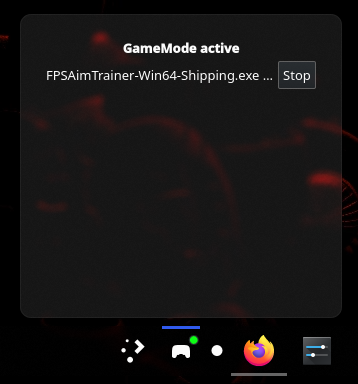
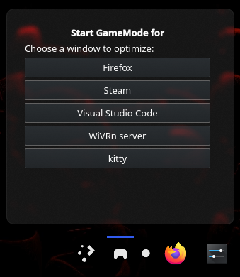

<p align="center">
  
  <h1 align="center">GameModer, Plasmoid for KDE Plasma</h1>
</p>

<p align="center">
  A lightweight and efficient widget to monitor and control <b>Feral's GameMode</b> directly from your KDE Plasma panel.
</p>

---

## Screenshots & Features

| Active Menu | Inactive Menu |
| :---: | :---: |
|  |  |
| **GameMode Active**<br>Displays registered PIDs and lets you manually unregister GameMode per process[cite: 1, 2]. | **GameMode Inactive**<br>Lists open application windows so you can manually trigger GameMode on any running process[cite: 2, 3]. |

---

## How It Works & Efficiency

Unlike widgets that rely on periodic checks (*polling rates*) or execute the `gamemode` CLI tool repeatedly, this plasmoid uses a **100% event-driven architecture**:

* **D-Bus Event Monitoring (`gdbus`):** Listens directly to `GameRegistered` and `GameUnregistered` signals on the session bus using a single persistent watcher (`watcher.sh`)[cite: 1].
* **0% Idle CPU Usage:** Reader processes block in the kernel and only wake when an actual state change is appended, eliminating background CPU overhead[cite: 1].
* **Shared State Stream (Multicast):** Writes updates to a runtime file (`state.data`)[cite: 1], enabling multiple widget instances to stay synced without spawning extra D-Bus connections[cite: 1, 3].
* **Smart Process Resolution:** Resolves human-readable names via `/proc` and D-Bus properties[cite: 1, 3], correctly identifying native binaries as well as Wine/Proton games[cite: 1].

---

## Installation

### Option 1: Via KDE Plasma GUI (Recommended)
1. Right-click your panel or desktop and select **Add Widgets...**
2. Click **Get New Widgets...** $\rightarrow$ **Download New Plasma Widgets...**
3. Search for **GameMode** and install it directly.

### Option 2: Manual Installation from Repository

**Method A: Copy `package` contents**
Clone the repository and copy the contents of the `package/` folder into your local Plasma applets directory:

```bash
mkdir -p ~/.local/share/plasma/plasmoids/com.github.GG2R10.gamemoder/
cp -r package/* ~/.local/share/plasma/plasmoids/com.github.GG2R10.gamemoder/
```

**Method B: Install Local Package**
1. Compress the contents of the `package/` directory into a `.zip` file (or rename it to .plasmoid).
2. Open Add Widgets... $\rightarrow$ Get New Widgets... $\rightarrow$ Install from local file...
3. Select your compressed archive.

> Note: If installing manually, you may need to restart plasmashell (plasmashell --replace &) for Plasma to detect the new widget.
